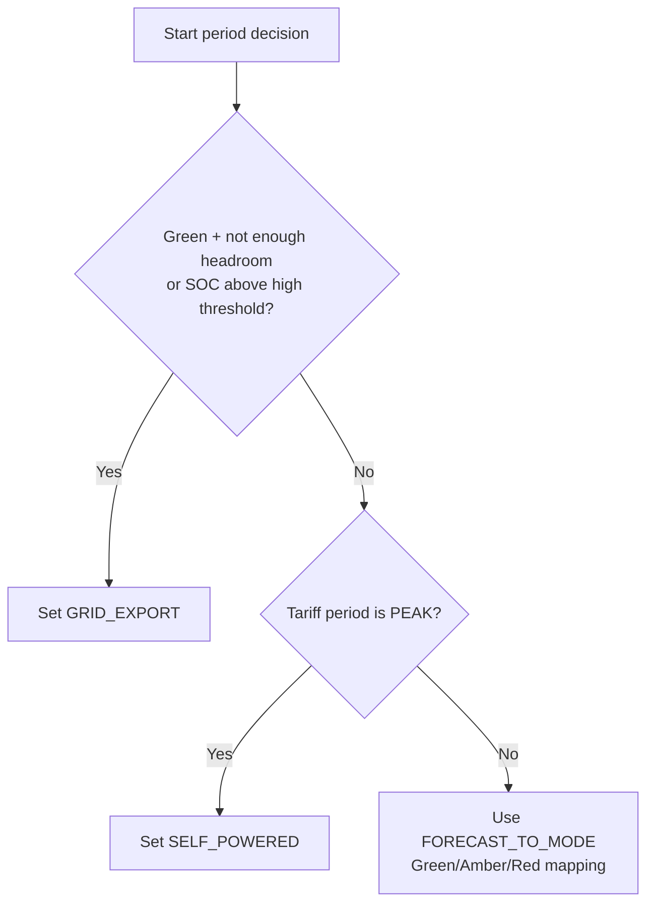

# Sigen Inverter Smart Control System

## Table of Contents

1. [Overview](#overview)
2. [Plain English Summary](#plain-english-summary)
3. [Key Files](#key-files)
4. [Setup](#setup)
5. [Configuration](#configuration)
6. [How It Works](#how-it-works)
7. [Scheduler Behavior](#scheduler-behavior)
8. [Logging](#logging)
9. [Web Simulator](#web-simulator)
10. [Tests](#tests)
11. [Notes](#notes)

## Overview

This project provides a locally run control system for a Sigen inverter using:

- Met Eireann solar forecast data
- Battery state of charge from the Sigen API
- Configurable operational mode mappings
- A self-contained scheduler that evaluates conditions throughout the day

The system can also be exercised through an interactive web simulator under `web/`.

## Plain English Summary

This system acts like an automatic energy assistant for your home battery and inverter.

It checks the expected solar generation for morning, afternoon, and evening, compares that
with how full your battery is right now, and then decides which inverter mode makes the most sense.

If the battery is likely to run out of space before strong solar arrives, it can export sooner
to create headroom and reduce wasted solar. If the battery is already very full and the forecast
is good, it can also choose export mode to avoid clipping. Otherwise it follows your normal
forecast-to-mode mapping rules.

This happens automatically on a timed loop, with detailed logs written on every check so you can
see exactly what values were used and why each decision was made.

## Key Files

```text
config.py             Runtime configuration and mode mappings
constants.py          Environment-backed location constants
decision_logic.py     Shared decision logic used by runtime and web simulator
sigen_auth.py         Authentication and singleton creation for Sigen API client
sigen_interaction.py  SigenInteraction wrapper for all Sigen API calls
main.py               Self-contained scheduler and runtime control loop
weather.py            Solar forecast parsing
sunrise_sunset.py     Sunrise/sunset lookup used to derive period windows
web/app.py            Flask web simulator backend
web/simulate_logic.py Web simulator wrapper around shared decision logic
web/static/           Simulator UI
tests/                Test suite
```

## Setup

1. Create and activate a virtual environment.

```sh
python3 -m venv .venv
source .venv/bin/activate
```

2. Install dependencies.

```sh
pip install -r requirements.txt
pip install pytest pytest-asyncio pytest-cov
```

3. Create a `.env` file in the project root.

```ini
SIGEN_USERNAME=your_sigen_email
SIGEN_PASSWORD=your_sigen_password
SIGEN_LATITUDE=53.3498
SIGEN_LONGITUDE=-6.2603
```

4. Edit `config.py` for your hardware and scheduler settings.

## Configuration

The core runtime settings live in `config.py`.

### Hardware

```python
SOLAR_PV_KW = 8.9
INVERTER_KW = 5.5
BATTERY_KWH = 24
```

### Scheduler and decision thresholds

```python
POLL_INTERVAL_MINUTES = 15
MAX_PRE_PERIOD_WINDOW_MINUTES = 120
FULL_SIMULATION_MODE = True
NIGHT_MODE_ENABLED = True
NEXT_DAY_PRECHECK_ENABLED = True
NIGHT_PRECHECK_DELAY_MINUTES = 30
LOCAL_TIMEZONE = "Europe/Dublin"
DAY_RATE_CENTS_PER_KWH = 26.596
PEAK_RATE_CENTS_PER_KWH = 32.591
NIGHT_RATE_CENTS_PER_KWH = 13.462
CHEAP_RATE_START_HOUR = 23
CHEAP_RATE_END_HOUR = 8
HEADROOM_FRAC = 0.25
SOC_HIGH_THRESHOLD = 95
```

Meaning:

- `POLL_INTERVAL_MINUTES`: how often the scheduler wakes up to evaluate each period
- `MAX_PRE_PERIOD_WINDOW_MINUTES`: how far ahead of a period start the scheduler begins checking SOC for possible export
- `FULL_SIMULATION_MODE`: when `True`, run full logic and logging but do not send inverter mode-change commands
- `NIGHT_MODE_ENABLED`: whether the scheduler explicitly applies the configured night mode overnight
- `NEXT_DAY_PRECHECK_ENABLED`: whether the scheduler evaluates the next morning's forecast during the night window
- `NIGHT_PRECHECK_DELAY_MINUTES`: how long after the night window starts before the next-day pre-check runs
- `LOCAL_TIMEZONE`: timezone used when evaluating tariff windows
- `DAY_RATE_CENTS_PER_KWH`: day unit rate for 08:00-17:00 and 19:00-23:00
- `PEAK_RATE_CENTS_PER_KWH`: peak unit rate for 17:00-19:00
- `NIGHT_RATE_CENTS_PER_KWH`: night unit rate for 23:00-08:00
- `CHEAP_RATE_START_HOUR`: local-hour start of cheap night rates
- `CHEAP_RATE_END_HOUR`: local-hour end of cheap night rates
- `HEADROOM_FRAC`: required free battery headroom as a fraction of expected solar energy for that period
- `SOC_HIGH_THRESHOLD`: if forecast is Green and SOC is at or above this threshold, export to grid

### Tariff schedule currently configured

The tariff schedule currently captured in `config.py` is:

- `08:00-17:00`: Day at `26.596 c/kWh`
- `17:00-19:00`: Peak at `32.591 c/kWh`
- `19:00-23:00`: Day at `26.596 c/kWh`
- `23:00-08:00`: Night at `13.462 c/kWh`

### Mode mappings

`SIGEN_MODES`, `FORECAST_TO_MODE`, and `TARIFF_TO_MODE` are all defined in `config.py`.

### Mode mappings in plain English

Think of mappings as the rulebook that converts a condition (forecast or tariff) into
an inverter behavior.

There are 3 layers:

1. The mode dictionary (`SIGEN_MODES`): this is the master list of inverter modes and
their numeric IDs used by the Sigen API.
2. The forecast mapping (`FORECAST_TO_MODE`): this says what to do for Green/Amber/Red
solar conditions.
3. The tariff mapping (`TARIFF_TO_MODE`): this says what to do for Day/Peak/Night price periods.

The runtime then applies decision priority rules on top of those mappings, so the final
mode is not always a direct lookup.

#### 1) `SIGEN_MODES` (what each mode means)

- `AI`: Let Sigen optimize automatically.
	Use this when conditions are normal and you want balanced behavior without forcing a hard strategy.
- `SELF_POWERED`: Prefer serving the home from solar + battery and avoid importing from grid when possible.
	Use this when grid prices are high (especially peak) or when maximizing self-consumption is preferred.
- `TOU`: Use time-of-use behavior.
	Typically used when tariff windows matter, especially at night when charging can be cheaper.
- `GRID_EXPORT`: Push energy to grid.
	Used intentionally to create battery headroom before strong solar, or when battery is already very full.
- `REMOTE_EMS` / `CUSTOM`: advanced modes available in Sigen, not used by default in this scheduler flow.

#### 2) `FORECAST_TO_MODE` (default weather-based behavior)

Current defaults are:

- Green -> `SELF_POWERED`
- Amber -> `AI`
- Red -> `TOU`

Plain English interpretation:

- Green (good expected solar): run in a mode that uses local solar/battery strongly.
- Amber (mixed day): keep flexible optimization.
- Red (poor expected solar): allow tariff-aware behavior.

Important: this is the default baseline only. Higher-priority rules can override it.

#### 3) `TARIFF_TO_MODE` (price-period behavior)

Current defaults are:

- Night -> `TOU`
- Day -> `AI`
- Peak -> `SELF_POWERED`

Plain English interpretation:

- Night (cheap): charging-oriented behavior is acceptable.
- Day (normal): balanced optimization is fine.
- Peak (expensive): avoid buying expensive grid power by favoring self-powered behavior.

#### Which mapping wins when they disagree?

The scheduler uses this order of precedence:

1. Safety/headroom export rules (highest priority)
2. Peak tariff override to self-powered (if export was not selected)
3. Forecast mapping fallback (Green/Amber/Red default)

So if forecast says one thing and tariff says another:

- Export rule can override both
- Peak period can override forecast (except when export rule triggers)
- Otherwise forecast mapping decides

#### Practical examples

Example A: Green morning, SOC already high, battery space too small for expected solar:

- Forecast mapping would normally pick `SELF_POWERED`
- Export headroom rule takes priority
- Final result: `GRID_EXPORT`

Example B: Amber period during peak tariff:

- Forecast mapping would pick `AI`
- Peak override forces self-powered strategy
- Final result: `SELF_POWERED`

Example C: Red period during normal day tariff:

- No export trigger
- No peak override
- Final result follows forecast mapping: `TOU`

Example D: Overnight before cheap window opens:

- Night-prep logic may want night mode
- But shoulder protection avoids charge-oriented behavior too early
- Final result can be `SHOULDER_NIGHT_MODE` (currently `AI`) until cheap hours begin

This is why changing one mapping value in `config.py` can alter behavior, but the final
runtime result still depends on SOC/headroom and tariff timing at that moment.

### Quick decision flow

Use this as the shortest possible mental model of what the runtime does when choosing a mode.



For overnight logic, this runs in parallel:

1. Apply night base mode by tariff phase (cheap-rate night mode or shoulder mode).
2. Optionally run next-day pre-check after configured delay.
3. If pre-check wants charge-oriented night mode but cheap-rate has not started yet, hold shoulder mode.

## How It Works

### Shared decision logic

The export and mode-selection logic is centralized in `decision_logic.py`.

All direct Sigen API calls are centralized in `sigen_interaction.py` via `SigenInteraction`.

Both of these use the same shared code path:

- `main.py` runtime scheduler
- `web/simulate_logic.py` web simulator

That ensures the simulator and the live runtime cannot drift apart.

### Battery headroom calculation

Battery headroom is the free storage space remaining in the battery:

$$
\text{headroom\_kwh} = \text{battery\_kwh} \times \left(1 - \frac{\text{soc}}{100}\right)
$$

Example:

- battery size = `24 kWh`
- SOC = `80%`

$$
24 \times (1 - 0.80) = 4.8 \text{ kWh}
$$

### Expected solar energy calculation

For the web simulator, expected solar for a period is:

$$
\text{period\_solar\_kwh} = \min(\text{solar\_pv\_kw}, \text{inverter\_kw}) \times 3.0
$$

For the runtime scheduler, the period forecast value is read in watts and converted to kWh over an assumed 3-hour period:

$$
\text{period\_solar\_kwh} = \min\left(\frac{\text{forecast\_watts}}{1000}, \text{solar\_pv\_kw}, \text{inverter\_kw}\right) \times 3.0
$$

### Export-to-grid rules

The system exports to grid under either of these conditions.

#### Rule 1: Insufficient headroom before a Green period

The target free headroom is:

$$
\text{headroom\_target\_kwh} = \text{period\_solar\_kwh} \times \text{HEADROOM\_FRAC}
$$

If:

$$
\text{headroom\_kwh} < \text{headroom\_target\_kwh}
$$

then the system selects `GRID_EXPORT` to create battery space ahead of the solar period.

#### Rule 2: High SOC on a Green forecast

If:

$$
\text{soc} \ge \text{SOC\_HIGH\_THRESHOLD}
$$

and the forecast status is `Green`, the system selects `GRID_EXPORT`.

### Day and peak tariff influence

In addition to forecast status and SOC/headroom, the scheduler also considers the
tariff period for the target time of the period action:

- `DAY` during 08:00-17:00 and 19:00-23:00
- `PEAK` during 17:00-19:00
- `NIGHT` during 23:00-08:00

Decision precedence for daytime periods is:

1. Export-to-grid safety/space rules (headroom shortfall or high SOC with Green forecast)
2. Peak tariff override: if tariff is `PEAK` and export was not selected, force self-powered mode to minimize expensive imports
3. Otherwise use the forecast mapping (Green/Amber/Red)

This means peak pricing can actively change the daytime mode choice, not just night windows.

### Dynamic export lead time

If more battery headroom is needed before the upcoming period, the scheduler estimates how early export should begin.

Headroom deficit:

$$
\text{headroom\_deficit\_kwh} = \max(0, \text{headroom\_target\_kwh} - \text{headroom\_kwh})
$$

Lead time before the period:

$$
\text{lead\_time\_hours} = \frac{\text{headroom\_deficit\_kwh} \times 1.1}{\text{inverter\_kw}}
$$

The `1.1` factor adds a 10% buffer.

The scheduler then calculates:

$$
\text{export\_by} = \text{period\_start} - \text{lead\_time}
$$

When current time is at or after `export_by`, it can trigger the pre-period export decision.

### Night behavior

The scheduler now has an explicit night window.

- Before the first daytime period starts, the system treats that as a pre-dawn night window.
- After sunset, the system treats that as the evening/night window for the upcoming day.

During the active night window it can do two separate things:

1. Apply either a shoulder mode or the configured night mode depending on local tariff time.
2. Optionally run a next-day pre-check for the next morning forecast after `NIGHT_PRECHECK_DELAY_MINUTES`.

For example, with cheap rates from 11pm to 8am:

- after sunset but before 11pm, the system stays in a shoulder mode so it does not start charge-oriented night behavior too early
- from 11pm to 8am local time, it can use `TARIFF_TO_MODE["NIGHT"]`
- after 8am, if the first daytime period has not started yet, it falls back out of the cheap-rate night mode again

The next-day pre-check uses the upcoming first daytime period, normally `Morn`.

If the next morning looks strong enough that headroom must be created, it can choose `GRID_EXPORT` overnight.
Otherwise it stays in the appropriate shoulder or cheap-rate night mode for the current local tariff phase.

### Full simulation mode (dry run)

Set `FULL_SIMULATION_MODE = True` in `config.py` to run safely without changing inverter state.

When enabled:

- the scheduler still runs all calculations and timing checks
- forecast and SOC are still fetched normally
- startup still fetches and logs current inverter mode
- every would-be mode change is logged clearly with a full separator banner and action details
- no `set_operational_mode(...)` command is sent to the inverter

This is intended for realistic test runs where you want full observability without altering the live system state.

## Scheduler Behavior

Running:

```sh
python main.py
```

starts a self-contained scheduler.

The scheduler:

1. Wakes every `POLL_INTERVAL_MINUTES`
2. Refreshes forecast and sunrise/sunset data once per day
3. Divides the daylight window from sunrise to sunset into equal period start times for `Morn`, `Aftn`, and `Eve`
4. Explicitly applies night mode during the night window when enabled
5. Optionally checks the next morning forecast during the night window and can prepare with export if needed
6. Begins monitoring each daytime period when inside the `MAX_PRE_PERIOD_WINDOW_MINUTES` window before that period starts
7. Fetches live SOC and evaluates export, forecast, and tariff-period rules for each period
8. Applies pre-period export at most once per period per day
9. Applies the definitive period-start mode at most once per period per day

## Logging

Logging is controlled by `LOG_LEVEL` in `config.py`.

Recommended values:

- `INFO` for normal operation
- `DEBUG` for detailed troubleshooting

### Check logging

Each scheduler evaluation writes an info log containing the values used and the conclusion reached.

For each check, the log includes:

- current UTC time
- period start time
- forecast watts
- forecast status
- expected solar kWh
- SOC
- battery headroom kWh
- target headroom kWh
- headroom deficit kWh
- calculated `export_by` time
- selected decision mode
- outcome
- reason

Example structure:

```text
[Morn] PRE-PERIOD CHECK | now=... | period_start=... | forecast_w=500 | status=Green |
expected_solar_kwh=1.50 | soc=82.0 | headroom_kwh=4.32 | headroom_target_kwh=0.38 |
headroom_deficit_kwh=0.00 | export_by=... | decision_mode=SELF_POWERED |
outcome=waiting until export window opens | reason=Default mapping for Green.
```

## Web Simulator

Start the web UI with:

```sh
python web/app.py
```

Then open:

```text
http://127.0.0.1:5000/
```

The simulator:

- preloads inverter, battery, and solar config values
- defaults SOC to `80%` while keeping it editable
- lets you simulate Morning, Afternoon, and Evening forecasts
- treats Night as tariff-driven (not a manual solar status)
- derives overnight prep decisions from the next morning forecast
- shows both the selected mode and a human-readable explanation
- uses the same shared decision logic as the live runtime

## Tests

Run all tests with:

```sh
source .venv/bin/activate
python -m pytest -q
```

Focused checks used during development:

```sh
python -m pytest -q web/test_app_simulate.py tests/test_main.py -rA
```

Coverage run:

```sh
python -m pytest -q --cov=. --cov-report=term-missing
```

## Notes

- The runtime scheduler is self-contained and does not require cron.
- The decision logic is centralized so runtime and simulator stay aligned.
- Sunrise/sunset times are used to derive dynamic daytime period boundaries.
