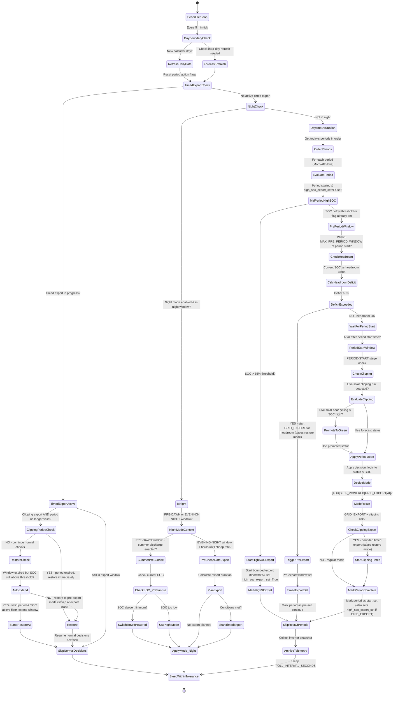
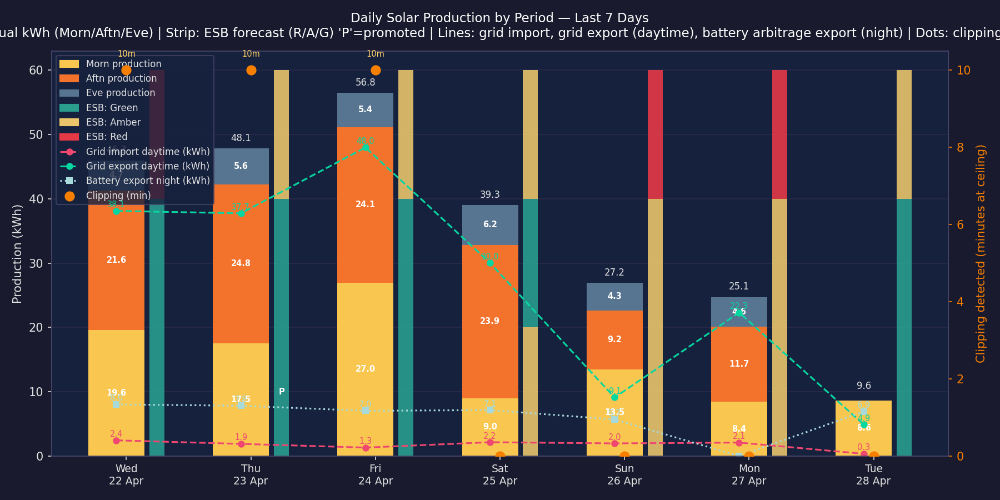
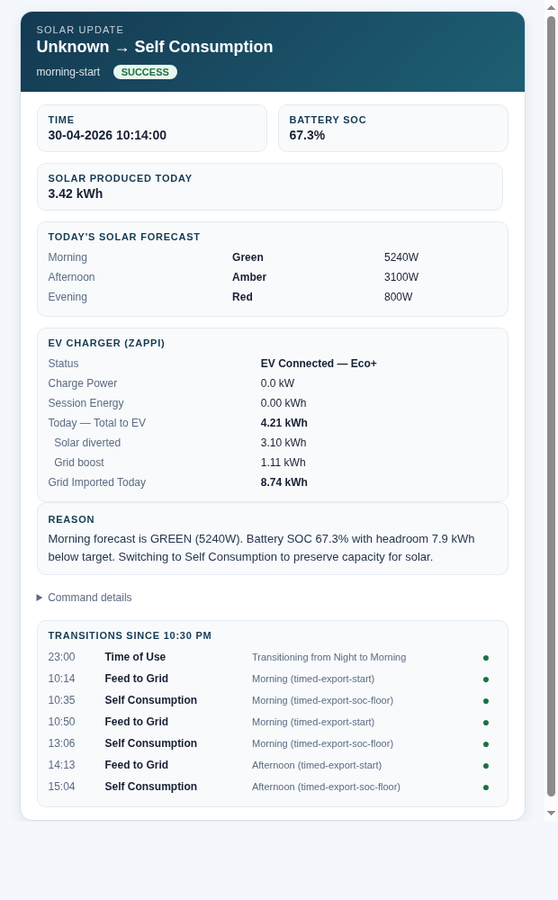

# Sigen Inverter Smart Control System

## Table of Contents

1. [Overview](#overview)
2. [Plain English Summary](#plain-english-summary)
3. [Quick Start](#quick-start)
4. [Key Files](#key-files)
5. [Setup](#setup)
6. [Configuration](#configuration)
   - [Hardware](#hardware)
   - [Portability](#portability)
   - [Scheduler and decision thresholds](#scheduler-and-decision-thresholds)
   - [Tariff schedule windows](#tariff-schedule-windows)
   - [Forecast providers](#forecast-providers-esb-primary-forecastsolar-backup-quartz-fallback-solcast-optional)
   - [Mode mappings](#mode-mappings)
   - [Decision order](#final-decision-order-very-important)
7. [How It Works](#how-it-works)
   - [Scheduler State Machine](#scheduler-state-machine)
   - [Battery headroom calculation](#battery-headroom-calculation)
   - [Export-to-grid rules](#export-to-grid-rules)
   - [Night behavior](#night-behavior)
   - [Full simulation mode](#full-simulation-mode-dry-run)
8. [Scheduler Behavior](#scheduler-behavior)
9. [Night Mode and TOU Strategy](#night-mode-and-tou-strategy)
   - [Overnight sequence](#overnight-sequence)
   - [Example strategy](#example-strategy-the-setup-this-project-was-built-for)
10. [Logging](#logging)
    - [Mode-change event archive](#mode-change-event-archive)
11. [Mode Test Utility](#mode-test-utility)
12. [Scripts Reference](#scripts-reference)
13. [Solar Clipping Chart](#solar-clipping-chart)
14. [Email Notifications](#email-notifications)
15. [Immersion Heater Control (SwitchBot)](#immersion-heater-control-switchbot) *(optional)*
    - [How it works](#how-it-works-1)
    - [Setup](#setup-1)
16. [Zappi EV Charger Integration](#zappi-ev-charger-integration) *(optional)*
17. [Forecast Accuracy Report](#forecast-accuracy-report)
18. [Adding a Forecast Provider](#adding-a-forecast-provider)
19. [Tests](#tests)
20. [Session Handoff Recovery](#session-handoff-recovery)
21. [Recent Updates](#recent-updates)
22. [Notes](#notes)

## Overview

This project provides a locally run control system for a Sigen inverter using:

- ESB county API forecast data (primary decision source)
- Optional Open Quartz forecast data (secondary comparison source)
- Battery state of charge from the Sigen API
- Configurable operational mode mappings
- A self-contained scheduler that evaluates conditions throughout the day

## Plain English Summary

This system acts like an automatic energy assistant for your home battery and inverter.

It checks the expected solar generation for morning, afternoon, and evening, compares that
with how full your battery is right now, and then decides which inverter mode makes the most sense.

If the battery is likely to run out of space before strong solar arrives, it can export sooner
to create headroom and reduce wasted solar. If the battery is already very full and the forecast
is good, it can also choose export mode to avoid clipping. Otherwise it follows your normal
forecast-to-mode mapping rules.

This happens automatically on a timed loop, with detailed logs written on every check so you can
see exactly what values were used and why each decision was made.

## Quick Start

**Requirements:** Python 3.11+, a Sigen inverter with API access, a Gmail account for notifications.

1. Clone the repo and set up the environment:
   ```sh
   python3 -m venv .venv && source .venv/bin/activate
   pip install -r requirements-dev.txt
   ```

2. Create a `.env` file in the project root:
   ```ini
   SIGEN_USERNAME=your_sigen_email
   SIGEN_PASSWORD=your_sigen_password
   SIGEN_LATITUDE=53.3498
   SIGEN_LONGITUDE=-6.2603
   EMAIL_SENDER=your_sender@gmail.com
   EMAIL_RECEIVER=your_receiver@gmail.com
   GMAIL_APP_PASSWORD=your_gmail_app_password
   ```

3. Set your hardware specs in `config/settings.py`:
   ```python
   SOLAR_PV_KW = 8.9   # your solar array size in kW
   INVERTER_KW = 5.5   # your inverter capacity in kW
   BATTERY_KWH = 24    # your battery capacity in kWh
   ```

4. Adjust these additional settings in `config/settings.py` for your setup:

   | Setting | Default | What to change |
   |---|---|---|
   | `LOCAL_TIMEZONE` | `"Europe/Dublin"` | Your local timezone string (e.g. `"Europe/London"`) |
   | `CHEAP_RATE_START_HOUR` | `23` | Hour your cheap-rate electricity starts (local time) |
   | `CHEAP_RATE_END_HOUR` | `8` | Hour your cheap-rate electricity ends (local time) |
   | `ESTIMATED_HOME_LOAD_KW` | `0.8` | Your average household draw in kW when solar is low |
   | `HEADROOM_TARGET_KWH` | `BATTERY_KWH * 0.6` | Free battery space to maintain before a Green forecast (40% SOC floor). The alternative physics formula is `(SOLAR_PV_KW - INVERTER_KW) * 3`; use whichever fits your clipping risk tolerance |
   | `AMBER_HEADROOM_FRACTION` | `0.25` | Fraction of battery capacity to keep free before an Amber forecast (e.g. `0.25` = 25%). Set to `0.0` to disable Amber headroom entirely |

   All solar trigger thresholds (`MID_PERIOD_SAFETY_SOLAR_TRIGGER_KW`, `LIVE_CLIPPING_RISK_SOLAR_TRIGGER_KW`) and discharge rate estimates (`PRE_CHEAP_RATE_NIGHT_EXPORT_ASSUMED_DISCHARGE_KW`, `EVENING_EXPORT_ASSUMED_DISCHARGE_KW`) are automatically derived from your hardware specs — you do not need to touch them.

5. **Note for non-Irish users:** The default forecast provider is the **ESB county API**, which is an Irish electricity grid service and only works in Ireland. It divides the day into four periods — `Morn`, `Aftn`, `Eve`, and `Night` — aligned to local Irish time. If you are outside Ireland, set `FORECAST_PROVIDER` in `config/settings.py` to `"forecast_solar"`, `"quartz"`, or `"solcast"` instead, and configure the corresponding API credentials. The period structure and decision logic work the same regardless of provider.

6. Run in simulation mode first (default). `FULL_SIMULATION_MODE = True` in `config/settings.py` means no commands are sent to the inverter — you can watch the decisions in the log safely.

6. Start the scheduler:
   ```sh
   ./start_monitor.sh
   tail -f monitor.log
   ```

7. When you are happy with the log output, set `FULL_SIMULATION_MODE = False` in `config/settings.py` and restart:
   ```sh
   ./restart_monitor.sh
   ```

## Key Files

```text
.
├── main.py                              # Entry point; wires state, callbacks, and starts the loop
├── requirements.txt                     # Runtime dependencies
├── requirements-dev.txt                 # Runtime + test dependencies
├── start_monitor.sh                     # Start scheduler in background
├── stop_monitor.sh                      # Stop scheduler
├── restart_monitor.sh                   # Stop then start scheduler
├── start_venv.sh                        # Activate virtual environment
├── config/
│   ├── settings.py                      # All tunable thresholds and hardware specs
│   ├── constants.py                     # Environment-backed location/path constants
│   └── enums.py                         # Period and ForecastStatus enums
├── logic/
│   ├── scheduler_coordinator.py         # Main loop orchestration — delegates to per-tick handlers
│   ├── scheduler_state.py               # Centralised mutable state dataclass (SchedulerState)
│   ├── scheduler_operations.py          # Forecast/sunrise refresh, live solar sampling, telemetry
│   ├── decision_logic.py                # Core mode-selection rules (headroom, SOC, tariff)
│   ├── period_handler_shared.py         # Shared helpers used by morning/afternoon/evening handlers
│   ├── decision_logging.py              # Canonical decision checkpoint logging function
│   ├── morning.py                       # Morning period handler
│   ├── afternoon.py                     # Afternoon period handler
│   ├── evening.py                       # Evening period handler
│   ├── night.py                         # Night window handler (TOU, pre-sunrise discharge, pre-cheap-rate export)
│   ├── timed_export.py                  # Timed grid export state machine (inactive → active → restored)
│   ├── mode_change.py                   # apply_mode_change (notification, archiving, simulation guard)
│   ├── mode_control.py                  # Inverter operational mode management and decision logic
│   ├── mode_logging.py                  # Mode status logging helpers
│   ├── inverter_control.py              # Command/write helpers and live-solar sampling
│   ├── immersion_control.py             # SwitchBot immersion heater boost control
│   ├── scenario_simulation.py           # Deterministic multi-day scenario generation and evaluation
│   └── schedule_utils.py               # Period detection, cheap-rate window calculations, and cheap-rate end time helper
├── integrations/
│   ├── sigen_interaction.py             # All Sigen API calls — centralizes mode get/set
│   ├── sigen_auth.py                    # Lazy-loaded singleton Sigen client from .env credentials
│   ├── sigen_official.py               # Official OpenAPI client (app key/secret auth)
│   ├── switchbot_interaction.py         # SwitchBot API client (immersion heater control)
│   ├── zappi_client.py                  # myenergi Zappi HTTP client with director-based discovery
│   ├── zappi_interaction.py             # Higher-level Zappi wrapper (live status, daily totals)
│   ├── zappi_auth.py                    # Singleton accessor — returns None when credentials absent
│   └── tools/
│       ├── check_api_config.py          # Diagnostic: query current Sigen API mode configuration
│       └── check_modes.py               # Print all available inverter operational modes
├── email/
│   └── email_sender.py                  # Gmail SMTP transport with STARTTLS/SSL fallback
├── weather/
│   ├── forecast.py                      # Provider selection and comparison facade
│   ├── providers/
│   │   ├── esb.py                       # ESB county API provider (primary decision source)
│   │   ├── forecast_solar.py            # Forecast.Solar provider (comparison)
│   │   ├── quartz.py                    # Quartz provider (comparison)
│   │   ├── solcast.py                   # Solcast rooftop provider with rate-limit-safe disk cache
│   │   ├── comparison.py                # Side-by-side provider comparison and archiving
│   │   └── common.py                    # Shared provider interfaces and base behaviour
│   └── sunrise_sunset.py               # Sunrise/sunset lookup for period window derivation
├── telemetry/
│   ├── telemetry_archive.py             # Inverter snapshot archiving and field extraction
│   └── forecast_calibration.py          # Daily bounded calibration from telemetry
├── notifications/
│   ├── email_notifications.py           # Mode-change email formatting and sending
│   └── notification_email_helpers.py    # Startup email and shared notification helpers
├── utils/
│   ├── logging_formatters.py            # Colour log formatter
│   ├── payload_tree.py                  # Debug helper: log nested API payload as a tree
│   ├── sensitive_values.py              # Mask credentials in log output
│   └── terminal_formatting.py          # ANSI colours, tables, and section headers
├── scripts/                             # Analysis, diagnostic, and utility scripts
│   ├── install_handoff_timer.sh         # Install systemd timer for session handoff snapshots
│   └── update_handoff_snapshot.sh       # Write docs/session-handoff-auto.md snapshot
└── tests/                               # Pytest test suite
```

## Setup

1. Create and activate a virtual environment.

```sh
python3 -m venv .venv
source .venv/bin/activate
```

2. Install dependencies.

```sh
pip install -r requirements-dev.txt
```

3. Create a `.env` file in the project root.

```ini
SIGEN_USERNAME=your_sigen_email
SIGEN_PASSWORD=your_sigen_password
SIGEN_LATITUDE=your_latitude
SIGEN_LONGITUDE=your_longitude
EMAIL_SENDER=your_sender@gmail.com
EMAIL_RECEIVER=your_receiver@gmail.com
GMAIL_APP_PASSWORD=your_gmail_app_password

# Optional — SwitchBot immersion heater (see Immersion Heater section below)
#SWITCHBOT_TOKEN=your_switchbot_token
#SWITCHBOT_SECRET=your_switchbot_secret
#SWITCHBOT_IMMERSION_DEVICE_ID=your_device_id

# Optional — myenergi Zappi EV charger (see Zappi section below)
#MYENERGI_HUB_SERIAL=your_hub_serial
#MYENERGI_API_KEY=your_api_key

# Optional — Solcast rooftop forecast (see Forecast providers section below)
#SOLCAST_API_KEY=your_solcast_api_key
```

4. Edit `config/settings.py` for your hardware and scheduler settings.

## Running the Monitor

Three shell scripts manage the scheduler process. All write logs to `monitor.log` in the project root.

| Script | Purpose |
|--------|---------|
| `start_monitor.sh` | Start the scheduler in the background. Refuses to start a second instance if one is already running. Writes the PID to `.monitor.pid`. |
| `stop_monitor.sh` | Stop the running scheduler gracefully. Uses `.monitor.pid` first, falls back to `pgrep`. |
| `restart_monitor.sh` | Stop then start in one step. Use this after changing `config/settings.py` to pick up new thresholds. |

```sh
# Start
./start_monitor.sh

# Stop
./stop_monitor.sh

# Restart (e.g. after a config change)
./restart_monitor.sh

# Follow live logs
tail -f monitor.log
```

## Configuration

The core runtime settings live in `config/settings.py`.

### Hardware

```python
SOLAR_PV_KW = 8.9
INVERTER_KW = 5.5
BATTERY_KWH = 24
```

### Portability

Changing the three hardware constants (`SOLAR_PV_KW`, `INVERTER_KW`, `BATTERY_KWH`) is enough to adapt the core decision logic to a different system. Most thresholds are derived automatically:

- Solar trigger thresholds scale with `SOLAR_PV_KW` (e.g. `LIVE_CLIPPING_RISK_SOLAR_TRIGGER_KW = SOLAR_PV_KW * 0.36`)
- Assumed discharge rates scale with `INVERTER_KW`
- Headroom target scales with `BATTERY_KWH`
- Forecast provider capacity parameters (`QUARTZ_SITE_CAPACITY_KWP`, `FORECAST_SOLAR_SITE_KWP`) are set to `SOLAR_PV_KW` automatically

These settings are **not** derived from hardware and need manual review:

| Setting | Why it needs review |
|---|---|
| `LOCAL_TIMEZONE` | Tariff window detection and period scheduling depend on local time |
| `CHEAP_RATE_START_HOUR` / `CHEAP_RATE_END_HOUR` | Varies by energy provider and tariff plan |
| `ESTIMATED_HOME_LOAD_KW` | Household draw varies; affects the evening battery-bridge rule |
| `HEADROOM_TARGET_KWH` | Currently `BATTERY_KWH * 0.6` (40% SOC floor). The physics alternative is `(SOLAR_PV_KW - INVERTER_KW) * 3` (surplus kW × 3 h reserve). For systems with a large battery relative to array surplus, the physics formula is more appropriate |
| `AMBER_HEADROOM_FRACTION` | Fraction of battery capacity to maintain as free headroom before an Amber period. Default `0.25` (25% of battery). Set to `0.0` to disable Amber pre-period exports entirely |
| `PRE_SUNRISE_DISCHARGE_MONTHS` | Months where pre-sunrise discharge is useful — adjust for your latitude and climate |

### Scheduler and decision thresholds

```python
POLL_INTERVAL_MINUTES = 5
FORECAST_REFRESH_INTERVAL_MINUTES = 30
FORECAST_SOLAR_ARCHIVE_ENABLED = True
FORECAST_SOLAR_ARCHIVE_INTERVAL_MINUTES = 30
MAX_PRE_PERIOD_WINDOW_MINUTES = 180
FULL_SIMULATION_MODE = True
NIGHT_MODE_ENABLED = True
LOCAL_TIMEZONE = "Europe/Dublin"
QUARTZ_RED_CAPACITY_FRACTION = 0.20
QUARTZ_GREEN_CAPACITY_FRACTION = 0.40
FORECAST_SOLAR_POWER_MULTIPLIER = 1.53
CHEAP_RATE_START_HOUR = 23
CHEAP_RATE_END_HOUR = 8
HEADROOM_TARGET_KWH = 14.4
AMBER_HEADROOM_FRACTION = 0.25
ENABLE_PRE_CHEAP_RATE_BATTERY_BRIDGE = True
ESTIMATED_HOME_LOAD_KW = 0.8
BRIDGE_BATTERY_RESERVE_KWH = 1.0
MORNING_HIGH_SOC_PROTECTION_ENABLED = True
MORNING_HIGH_SOC_THRESHOLD_PERCENT = 55.0
LIVE_CLIPPING_RISK_VALID_PERIODS = "M,A"
LIVE_CLIPPING_RISK_SOC_THRESHOLD_PERCENT = 50.0
LIVE_CLIPPING_RISK_SOLAR_TRIGGER_KW = 4.5
DAYTIME_TIMED_EXPORT_MIN_SOC_PERCENT = 40.0
ENABLE_SUMMER_PRE_SUNRISE_DISCHARGE = True
PRE_SUNRISE_DISCHARGE_MONTHS = "4,5,6,7,8,9"
PRE_SUNRISE_DISCHARGE_LEAD_MINUTES = 120
```

Meaning:

- `POLL_INTERVAL_MINUTES`: how often the scheduler wakes up to evaluate each period
- `FORECAST_REFRESH_INTERVAL_MINUTES`: how often forecast data refreshes during the day (`0` disables intra-day refresh)
- `FORECAST_SOLAR_ARCHIVE_ENABLED`: enables per-tick raw Forecast.Solar pulls to local archive
- `FORECAST_SOLAR_ARCHIVE_INTERVAL_MINUTES`: minimum minutes between raw Forecast.Solar archive pulls; `30` is a sensible default for the public tier because its forecast resolution is hourly
- `MAX_PRE_PERIOD_WINDOW_MINUTES`: how far ahead of a period start the scheduler begins checking SOC for possible export
- `FULL_SIMULATION_MODE`: when `True`, run full logic and logging but do not send inverter mode-change commands
- `NIGHT_MODE_ENABLED`: whether the scheduler explicitly applies the configured night mode overnight
- `LOCAL_TIMEZONE`: timezone used when evaluating tariff windows
- `CHEAP_RATE_START_HOUR`: local-hour start of cheap night rates
- `CHEAP_RATE_END_HOUR`: local-hour end of cheap night rates
- `FORECAST_PROVIDER`: active provider (`esb_api`, `forecast_solar`, `quartz`, or `solcast`)
- `ESB_FORECAST_COUNTY`: county name used for ESB county API lookup (e.g., `Westmeath`)
- `QUARTZ_FORECAST_API_URL`: Open Quartz endpoint (used for comparison or as active provider)
- `QUARTZ_SITE_CAPACITY_KWP`: site capacity sent to Quartz when used
- `QUARTZ_RED_CAPACITY_FRACTION`: lower Quartz status threshold as a fraction of configured array capacity
- `QUARTZ_GREEN_CAPACITY_FRACTION`: upper Quartz status threshold as a fraction of configured array capacity
- `FORECAST_SOLAR_POWER_MULTIPLIER`: scalar applied to Forecast.Solar watts before period status/value normalization; use this to correct persistent local bias (for example, historical under-forecasting)
- `SOLCAST_MIN_FETCH_INTERVAL_MINUTES`: minimum minutes between live Solcast API calls (default `100`); cached response from `data/solcast_readings.jsonl` is used in between. Live fetches are further restricted to the `SOLCAST_FETCH_WINDOW_START_HOUR`–`SOLCAST_FETCH_WINDOW_END_HOUR` local-time window (default 03:00–20:00); outside that window the cache is always served regardless of age, concentrating all 10 free-tier calls in the hours that matter for decisions
- `HEADROOM_TARGET_KWH`: fixed battery headroom target for Green periods (14.4 kWh = BATTERY_KWH × 0.6, corresponding to a 40% SOC floor)
- `DAYTIME_TIMED_EXPORT_MIN_SOC_PERCENT`: unified SOC floor for all daytime timed exports — both proactive headroom exports and mid-period clipping-risk exports stop when SOC hits this level (default `40.0`)
- `AMBER_HEADROOM_FRACTION`: fraction of battery capacity to maintain as free headroom before Amber periods (default `0.25`); `AMBER_HEADROOM_TARGET_KWH` is derived as `BATTERY_KWH * AMBER_HEADROOM_FRACTION`. Set to `0.0` to disable Amber headroom
- `ENABLE_PRE_CHEAP_RATE_BATTERY_BRIDGE`: when enabled, Evening decisions avoid charge-oriented behavior before cheap-rate starts if battery can bridge the expected load
- `ESTIMATED_HOME_LOAD_KW`: average household load estimate used to calculate whether current battery energy can cover consumption until cheap-rate begins
- `BRIDGE_BATTERY_RESERVE_KWH`: safety buffer to keep in battery when evaluating bridge sufficiency
- `MORNING_HIGH_SOC_PROTECTION_ENABLED`: enables high-SOC export protection rule for selected daytime periods
- `MORNING_HIGH_SOC_THRESHOLD_PERCENT`: SOC trigger threshold for the mid-period high-SOC safety export (default 55%, which is 15% above the 40% export floor set by `DAYTIME_TIMED_EXPORT_MIN_SOC_PERCENT`)
- `LIVE_CLIPPING_RISK_VALID_PERIODS`: comma-separated period codes where live clipping-risk Amber→Green promotion is active (`M`=Morning, `A`=Afternoon, `E`=Evening). Controls both the intra-tick promotion check and the lifetime of any clipping export — if the active period transitions outside this set, the clipping export is stopped immediately.
- `LIVE_CLIPPING_RISK_SOC_THRESHOLD_PERCENT`: SOC threshold for live clipping-risk Amber→Green promotion
- `LIVE_CLIPPING_RISK_SOLAR_TRIGGER_KW`: rolling live-solar kW threshold for live clipping-risk promotion
- `ENABLE_SUMMER_PRE_SUNRISE_DISCHARGE`: enables optional pre-sunrise discharge window in selected months
- `PRE_SUNRISE_DISCHARGE_MONTHS`: local months where pre-sunrise discharge can run (for example Apr-Sep)
- `PRE_SUNRISE_DISCHARGE_LEAD_MINUTES`: minutes before sunrise where night mode can switch to self-powered to create headroom
- `MODE_CHANGE_RETRY_ATTEMPTS`: number of additional attempts after an initial mode-change failure (`3` = up to 4 total tries). Set to `0` to disable retries.
- `MODE_CHANGE_RETRY_DELAY_SECONDS`: seconds to wait between retry attempts (`120` = 2 minutes). With the defaults, a failure at 23:00 retries at 23:02, 23:04, and 23:06 before giving up — well within the cheap-rate window.

### Tariff schedule windows

The tariff time windows in `config/settings.py` define when each tariff period is active. These drive period detection and cheap-rate window checks used by the scheduler:

- `08:00-17:00`: Day period
- `17:00-19:00`: Peak period
- `19:00-23:00`: Day period (evening)
- `23:00-08:00`: Night / cheap-rate window

The scheduler uses these windows to determine whether to use self-powered or TOU modes at each transition. Actual electricity rates (c/kWh) are not stored in the config — the system makes mode decisions from forecast quality, SOC/headroom, and tariff period.

### Forecast providers (ESB primary, Forecast.Solar backup, Quartz fallback, Solcast optional)

Forecast ingestion is abstracted behind a stable provider interface in `weather/forecast.py`.

- Default runtime mode (`FORECAST_PROVIDER=esb_api`) uses ESB county API data for decisions.
- In ESB mode, the app pulls Forecast.Solar first and Quartz second and logs a period-by-period comparison summary each refresh.
- Forecast.Solar and Quartz are comparison-only in this mode; inverter decisions still follow ESB-derived statuses.
- Secondary and tertiary providers are comparison-only — they are logged but do not influence decisions or headroom calculations.
- If you set `FORECAST_PROVIDER=forecast_solar`, Forecast.Solar becomes the decision source.
- If you set `FORECAST_PROVIDER=quartz`, Quartz becomes the decision source.
- If you set `FORECAST_PROVIDER=solcast`, Solcast becomes the decision source (see Solcast section below).

Why keep Forecast.Solar/Quartz as secondary sources while ESB is primary:

- ESB county statuses align with the public county forecast users already see.
- Forecast.Solar and Quartz provide independent site-level predictions, useful for validating trends and potential future migration.
- Running both lets you quantify match/mismatch over time before changing decision source.

How the comparison is normalized:

- ESB and Quartz are not naturally comparable. ESB is county-level and categorical (`Red`/`Amber`/`Green`), while Quartz is site-level and numeric (predicted power by timestamp).
- Quartz timestamps are first converted into the local tariff timezone (`Europe/Dublin`) before grouping into project periods (`Morn`, `Aftn`, `Eve`, `NIGHT`). This avoids false mismatches caused by comparing UTC buckets to local scheduler windows.
- Quartz period status is derived from average predicted output as a share of configured array size (`QUARTZ_SITE_CAPACITY_KWP`). Current normalization is:
	- `Red`: less than `QUARTZ_RED_CAPACITY_FRACTION` (default 20%)
	- `Amber`: from `QUARTZ_RED_CAPACITY_FRACTION` up to `QUARTZ_GREEN_CAPACITY_FRACTION` (default 20% to <40%)
	- `Green`: `QUARTZ_GREEN_CAPACITY_FRACTION` or more (default >=40%)
- ESB still exposes synthetic placeholder forecast values (`Red=1000`, `Amber=2500`, `Green=5000`) internally so the rest of the control logic keeps working unchanged. In comparison logs these are explicitly labelled as synthetic and not as measured site power.

Why the normalization exists:

- Without local-time bucketing, Quartz can look wrong simply because its morning energy lands in the wrong scheduler period.
- Without capacity-based thresholds, Quartz will look unrealistically optimistic for a larger array because even modest output easily exceeds tiny fixed watt cutoffs.
- Without labelling ESB values as synthetic, the logs can make county statuses look like real measured watts, which is misleading.
- The goal is not to force perfect agreement. The goal is to make ESB-vs-Quartz differences interpretable enough to judge whether Quartz is a credible future decision source.

Actual inverter telemetry is also archived locally for later analysis:

- The scheduler appends one raw inverter snapshot per tick to `data/inverter_telemetry.jsonl` when the inverter API is reachable.
- Each record includes the raw `get_energy_flow()` payload, current operational mode, scheduler timestamp, and the forecast state seen by the scheduler at that time.
- When night sleep mode is active, the scheduler also writes a dedicated `night_sleep_start` snapshot before entering the long evening sleep window so the latest daily totals (including `pvDayNrg`) are preserved.
- Each record also includes derived clipping heuristics. A sample is flagged as likely clipping only when inverter-side solar equals the `5.5 kW` ceiling.
- This file is intended for post-run analysis so you can compare forecasted periods against what the inverter and battery actually did.

#### Solcast rooftop forecast provider

[Solcast](https://toolkit.solcast.com.au) offers a site-specific rooftop PV forecast based on satellite irradiance data. The free Hobbyist tier allows **10 API calls per day**.

**Setup**

1. Register at [toolkit.solcast.com.au](https://toolkit.solcast.com.au) and create a rooftop site with your location, tilt, and azimuth.

2. **Azimuth convention**: Solcast uses **North = 0°, East = negative, West = positive** (not Forecast.Solar's South = 0°). For a panel facing 40° east of south (compass bearing 140°), enter **-140** in Solcast.

3. **Inverter size**: Set the "inverter size" field in Solcast to your **array DC capacity** (e.g. 8.9 kW), not your actual inverter AC limit. If you enter the AC limit, Solcast caps every forecast period at that value, which removes the shape of the curve and makes it less useful for clipping-risk decisions. Setting it to the array capacity lets the forecast reflect what the panels can actually produce.

4. Find your **API key** in the Solcast Toolkit under Account → API Key.

5. Find your **rooftop resource URL** in the Toolkit — it looks like:
   ```
   https://api.solcast.com.au/rooftop_sites/<site-id>/forecasts?format=json
   ```

6. Add to `.env`:
   ```ini
   SOLCAST_API_KEY=your_api_key
   ```
   The rooftop URL is hardcoded in `config/constants.py` as `SOLCAST_ROOFTOP_URL`; override it with `SOLCAST_ROOFTOP_URL=...` in `.env` if needed.

7. Set `FORECAST_PROVIDER=solcast` in `.env` (or leave as `esb_api` to keep using ESB for decisions while evaluating Solcast separately).

**Rate-limit caching**

To stay within the 10-calls/day limit the provider uses two complementary controls:

1. **Fetch window** (`SOLCAST_FETCH_WINDOW_START_HOUR` / `SOLCAST_FETCH_WINDOW_END_HOUR`, default **03:00–20:00 local**): outside this window the cache is served unconditionally regardless of age. There is no solar generation overnight and tomorrow's forecast won't change meaningfully before 03:00, so live API calls in those hours waste quota. The 03:00 start gives a one-hour buffer before the pre-period export window opens.
2. **Minimum interval** (`SOLCAST_MIN_FETCH_INTERVAL_MINUTES`, default **100 minutes**): within the fetch window, the cached response is reused until this interval elapses. 100 minutes across a 17-hour window (03:00–20:00) gives at most 10 fetches/day — exactly the free-tier limit.

Adjust `SOLCAST_MIN_FETCH_INTERVAL_MINUTES` in `config/settings.py` to trade freshness against quota. Narrowing the fetch window hours reduces the effective call count for the same interval.

Daily bounded calibration is also applied from that telemetry:

- On daily forecast refresh, the scheduler reads recent telemetry from `data/inverter_telemetry.jsonl` and writes a bounded calibration artifact to `data/forecast_calibration.json`.
- The calibration adjusts two numeric inputs per daytime period (`Morn`, `Aftn`, `Eve`):
	- `power_multiplier`: inflates forecast watts when recent actual PV has been consistently higher than forecast
	- `export_lead_buffer_multiplier`: starts pre-export slightly earlier when clipping risk has been recurring
- Changes are deliberately bounded per day so the system cannot swing too far overnight.
- The rule structure does not self-rewrite. It keeps the existing decision logic with fixed hardware-based headroom targets.
- Manual rebuild is also available with `python telemetry/forecast_calibration.py`.

### Mode mappings

`SIGEN_MODES`, `FORECAST_TO_MODE`, and `PERIOD_TO_MODE` are all defined in `config/settings.py`.

### Mode mappings in plain English

The easiest way to read this is:

- `SIGEN_MODES` = the list of available inverter modes.
- `FORECAST_TO_MODE` = your default weather rules.
- `PERIOD_TO_MODE` = your default price-period rules.

Current defaults in this project:

- Green -> `SELF_POWERED`
- Amber -> `SELF_POWERED`
- Red -> `SELF_POWERED`
- Night tariff -> `TOU`
- Peak tariff -> `SELF_POWERED`

Mode descriptions:

| Mode | Main idea | How it behaves day-to-day | When to use it |
| --- | --- | --- | --- |
| **Sigen AI Mode** | The inverter uses smart algorithms and schedule data to decide when to charge, discharge, or export to minimize your electricity cost. | Automatically switches between self-consumption, TOU-like scheduling, and grid export based on predicted solar, load, and tariff. It is currently the recommended primary mode in the commissioning guide. | Best if you are on a variable tariff, have dynamic pricing, or just want the system to manage everything without manual time-based rules. |
| **Self-consumption Mode** | The system prioritizes using solar and battery for your own loads instead of sending power to the grid. | Solar first powers the house; surplus charges the battery; only what remains after that is exported. The battery discharges to cover home loads when solar is low, aiming to reduce grid import as much as possible. | Good if your main goal is to maximize self-use of solar, reduce your bills, and you do not care much about exporting to the grid. |
| **Fully Fed to Grid Mode** | The system's priority is to push PV generation to the grid rather than store it in the battery. | Solar is sent to the grid first; the battery is only used if specifically scheduled or forced (for example, backup). Self-consumption is minimised unless overridden by other settings. | Mainly for setups where export is the main goal (for example, certain feed-in tariff systems, or where battery storage is secondary). |
| **Time-based Control (TOU) Mode** | The system follows a schedule you define for charging, discharging, and self-consumption during different time windows. | You set up charge windows (for example, `00:00-05:00`) to charge the battery from grid when electricity is cheap, and discharge windows (for example, `17:00-22:00`) to use stored energy when prices are high. Other times can be set to self-consumption or grid-only. | Ideal if you are on a time-of-use tariff (cheaper at night, expensive during peak hours) and want to arbitrage between cheap-charge and expensive-use periods. |
| **Remote EMS / Time-based EMS** | The system is controlled by a remote-scheduling service (for example, via the mySigen app or installer-defined schedules). | Charge/discharge times and SOC limits are pushed from the cloud or installer view, overriding or layering on top of local modes. TOU rules can be set remotely without touching the local-mode table. | Used when an installer or platform wants centrally managed scheduling (for example, for multiple homes, grid-support schemes, or dynamic market signals). |

### Final decision order (very important)

The runtime does not just apply one mapping directly. It uses this order:

1. Export rules first (highest priority):
If forecast is Green and battery headroom is too low, use `GRID_EXPORT`.
Live clipping-risk can promote Amber to Green when configured period, SOC, and live-solar triggers are met.
High-SOC export protection can also force export in configured periods when SOC is high and headroom is below target.
2. Evening bridge rule second:
If period is Evening and battery can safely cover expected household demand until cheap-rate starts, use `SELF_POWERED`.
3. Peak-price rule third:
If export is not needed and tariff is Peak, use `SELF_POWERED`.
4. Default mapping last:
If neither of the above applies, use `FORECAST_TO_MODE` (Green/Amber/Red).
5. Controlled evening export at period-start (optional final override):
If evening SOC is high enough and protected-load criteria are met, start a bounded timed `GRID_EXPORT` window; otherwise keep the standard mode.

### Plain “if/then” version

For daytime periods, read it like this:

1. If Green forecast AND battery space is too small for expected solar -> `GRID_EXPORT`.
2. Else if period is Evening and battery can cover expected load until cheap-rate starts -> `SELF_POWERED`.
3. Else if tariff is Peak -> `SELF_POWERED`.
4. Else -> use forecast mapping (Green/Amber/Red).
5. At Evening period-start, if controlled export thresholds are met -> run bounded timed `GRID_EXPORT`, then restore.

For night:

1. Apply `PERIOD_TO_MODE["NIGHT"]` throughout the active night window.
2. In configured summer months, optionally switch to `SELF_POWERED` for a short pre-sunrise lead window to create morning headroom.

### Quick examples

- Green + headroom < 14.4 kWh -> `GRID_EXPORT` (insufficient space for incoming solar).
- Green + headroom >= 14.4 kWh -> Follow forecast mode (battery can absorb the solar).
- Amber + Peak tariff -> `SELF_POWERED` (peak override wins).
- Red + normal Day tariff -> `SELF_POWERED` (default forecast mapping).

## How It Works

### Shared decision logic

The export and mode-selection logic is centralized in `logic/decision_logic.py`.

All direct Sigen API calls are centralized in `integrations/sigen_interaction.py` via `SigenInteraction`.

### Scheduler State Machine

The runtime scheduler in `main.py` operates as a state machine running every 5 minutes:



**Key state flows:**

- **Timed Export Override**: Once active (from pre-export, clipping, or high-SOC), all normal scheduler decisions are skipped until the export window expires or SOC floor is reached (early exit). The restore target mode is saved at export start, not at restore time.
- **Auto-Extension**: If the export window expires but export conditions are still active, the restore timestamp is bumped forward rather than restoring — this avoids the stop/cooldown/restart gap. For headroom-based exports, "still active" means SOC is still above the effective floor **and the active period has not changed** — if the period has advanced (e.g. an Afternoon pre-period export reaching the Evening boundary), the export is restored immediately rather than extended so the incoming period handler can take over. The floor is recalculated from the current forecast only when the **active period matches the trigger period** — so if the forecast for that period has changed (e.g. Green→Amber), the updated Amber floor (75%) applies. During the pre-period run-up, when the active period is a different period from the one the export was triggered for, the floor stored at export start is used instead — this prevents the adjacent period's Amber floor from firing and cutting the export short before the target period even begins. For clipping exports, "still active" means SOC is still above `LIVE_CLIPPING_RISK_SOC_THRESHOLD_PERCENT` **and** the current period is still in `LIVE_CLIPPING_RISK_VALID_PERIODS`; if the period has moved outside the valid set (e.g. into Evening), the export is stopped immediately rather than extended. **Neither export type will auto-extend once the cheap-rate window has started** — the export is restored immediately at that point so TOU mode can take over on time.
- **Day Boundary**: Triggers forecast and sunrise/sunset refresh; resets per-period action flags (pre-set, start-set, clipping-export-set, high-soc-export-set)
- **Night Branching**: If night mode is enabled, either handles summer pre-sunrise discharge (PRE-DAWN) or pre-cheap-rate export (EVENING-NIGHT)
- **Daytime Evaluation**: For each period in order:
  1. **MID-PERIOD CLIPPING**: If the period has started, live solar is near the inverter ceiling and SOC is above threshold, promotes Amber → Green and starts a bounded clipping GRID_EXPORT; retries each tick until the export starts (cooldown will not suppress the retry by setting the flag prematurely)
  2. **MID-PERIOD HIGH-SOC**: If the period has started and SOC is above the trigger threshold (55%) and the one-shot flag is not yet set, starts a bounded GRID_EXPORT down to the 40% floor; fires at most once per period
  2. **PRE-PERIOD**: Checks headroom deficit; if buffer shortfall detected, triggers bounded GRID_EXPORT
  3. **PERIOD-START**: Detects live clipping risk (solar near inverter ceiling) and promotes forecast status; applies final mode decision. If the period-start decision is GRID_EXPORT, also sets `high_soc_export_set` — preventing the mid-period high-SOC check from re-triggering after the period-start export completes. (If solar genuinely pushes SOC high enough to trigger live clipping-risk promotion, that path handles it independently.)
- **Live Clipping Promotion**: If Amber forecast but live solar is near ceiling and SOC is high, runtime system promotes it to Green for export decisions
- **Mode Application**: Switches inverter to decided mode via Sigen API and records telemetry
- **Restore**: Timed export windows automatically restore to the mode that was active when the export started

### Official OpenAPI integration (`integrations/sigen_official.py`)

The project includes an official API client implementation that can be used by the
interaction layer when running against OpenAPI endpoints:

- Supports both account auth and app key/secret auth
- Auto-discovers `system_id` from the system list when not explicitly configured
- Allows endpoint path overrides via environment variables so path changes can be
	handled without code edits
- Keeps a compatibility mode for account auth payload variants observed across
	different tenants/regions

Important constraints:

- We do not currently have access to every official API capability in all environments.
- Some endpoints documented in the official markdown may be unavailable or permission-
	restricted depending on tenant, app type, and account scopes.
- Observed mode values can include legacy/account values beyond the small public enum
	subset, so the client preserves both officially documented and observed values.

Operational recommendation:

- Treat `.github/reference/Sigen API/API Documentation/` as source of truth for
	endpoint semantics.
- Validate endpoint availability against your own account credentials before assuming
	a documented endpoint can be used in production.

Both runtime and scripts use the same shared code path:

- `main.py` runtime scheduler

This keeps decision behavior consistent across scheduler execution and script-based tooling.

### Battery headroom calculation

Battery headroom is the free storage space remaining in the battery:

$$
	ext{headroom} = \text{battery capacity} \times \left(1 - \frac{\text{SOC}}{100}\right)
$$

Example:

- battery size = `24 kWh`
- SOC = `80%`

$$
24 \times (1 - 0.80) = 4.8 \text{ kWh}
$$

### Expected solar energy calculation

For the runtime scheduler, the period forecast value is read in watts and converted to kWh over an assumed 3-hour period:

$$
	ext{period solar} = \min\left(\frac{\text{forecast watts}}{1000}, \text{solar PV kW}, \text{inverter kW}\right) \times 3.0
$$

### Export-to-grid rules

The system exports to grid under these conditions.

#### Rule 1: Insufficient headroom before a Green or Amber period

The headroom target varies by forecast status:

| Forecast | Target | Setting |
|---|---|---|
| Green | `BATTERY_KWH × 0.6` (e.g. 14.4 kWh) | `HEADROOM_TARGET_KWH` |
| Amber | `BATTERY_KWH × 0.25` (e.g. 6 kWh) | `AMBER_HEADROOM_TARGET_KWH` (derived from `AMBER_HEADROOM_FRACTION`) |
| Red | — (no headroom export) | — |

The Green target is a fixed fraction of the battery, ensuring enough free space to absorb a full day's solar without clipping:

$$
\text{headroom target (Green)} = \text{BATTERY\_KWH} \times 0.6 = 24 \times 0.6 = 14.4 \text{ kWh}
$$

The Amber target is a reduced fraction of the battery, reflecting that Amber days carry real but moderate solar risk — enough to warrant partial headroom, but not the full Green reserve. Setting `AMBER_HEADROOM_FRACTION = 0.0` disables Amber headroom entirely.

If:
$$
\text{headroom} < \text{headroom target}
$$

then the system selects `GRID_EXPORT` to create battery space ahead of the solar period.

**Why this model is superior:** The old fraction-based model (0.25 × forecast) was fundamentally broken because it relied on ESB synthetic forecast categories (500W "Green" label) rather than real solar predictions. This led to ultra-small targets (0.375 kWh at SOC=100%) and essentially no early lead time. The fixed battery-capacity model instead grounds the target in the battery size itself: *what fraction of the battery must be free to absorb expected solar on a good day?* This is deterministic, testable, and produces realistic lead times (~2 hours at SOC=100% for Green periods).

### Day and peak tariff influence

In addition to forecast status and SOC/headroom, the scheduler also considers the
tariff period for the target time of the period action:

- `DAY` during 08:00-17:00 and 19:00-23:00
- `PEAK` during 17:00-19:00
- `NIGHT` during 23:00-08:00

Decision precedence for daytime periods is:

1. Export-to-grid safety/space rules (headroom shortfall before a Green period)
2. Peak tariff override: if tariff is `PEAK` and export was not selected, force self-powered mode to minimize expensive imports
3. Otherwise use the forecast mapping (Green/Amber/Red)

This means peak pricing can actively change the daytime mode choice, not just night windows.

### Dynamic export lead time

If more battery headroom is needed before the upcoming period, the scheduler estimates how early export should begin.

Headroom deficit:

$$
\text{headroom deficit} = \max(0, \text{headroom target} - \text{headroom})
$$

Lead time before the period:

$$
\text{solar avg kW (latest 3)} = \text{average of latest 3 live solar readings}
$$

$$
\text{effective battery export kW} = \max(0.2, \text{inverter kW} - \text{solar avg kW (latest 3)})
$$

$$
\text{lead time hours} = \frac{\text{headroom deficit} \times \text{export lead buffer multiplier}}{\text{effective battery export kW}}
$$

This causes earlier export start when live solar is already high (because less inverter headroom remains for battery discharge).

The scheduler then calculates:

$$
\text{export target} = \max(\text{period start},\ \text{cheap-rate end})
$$

$$
\text{export by} = \text{export target} - \text{lead time}
$$

When current time is at or after `export_by`, it triggers the pre-period export decision.

**Why anchor to cheap-rate end rather than period start?**
In summer the morning solar period starts at sunrise (e.g. 05:20 BST) but cheap-rate TOU charging continues until 08:00 BST. Exporting early to create headroom would be immediately undone by TOU refilling the battery from the grid. By anchoring the target to `max(period_start, cheap_rate_end)`, the export is timed to complete just as TOU stops — so headroom is created at the moment it can actually be preserved. The pre-period window and export duration are both extended to match this later target.

### Night behavior

The scheduler now has an explicit night window.

- Before the first daytime period starts, the system treats that as a pre-dawn night window.
- After sunset, the system treats that as the evening/night window for the upcoming day.

During the active night window it can do three separate things:

1. Apply the configured night mode (`PERIOD_TO_MODE["NIGHT"]`).
2. In configured summer months, switch to self-powered shortly before sunrise to allow controlled pre-sunrise discharge.
3. Optionally sleep between checks to reduce polling until the morning pre-period window opens.

For example, with cheap rates from 11pm to 8am:

- after sunset and before the first daytime period, the scheduler holds the configured night mode
- if night sleep mode is enabled, it can sleep and wake near the morning pre-period window

### Controlled evening export and cheap-rate recharge

The default strategy is now scheduler-driven and deterministic (no forced AI transition):

1. Run daytime in self-powered unless export protection rules trigger.
2. During evening, keep self-powered where battery can bridge expected load.
3. If SOC is high after peak and protected-load criteria are met, start a bounded timed `GRID_EXPORT` window.
4. During cheap-rate night window, apply `PERIOD_TO_MODE["NIGHT"]` (default `TOU`) so configured cheap-rate charging can refill battery.
5. In configured summer months, switch to self-powered shortly before sunrise to create space for morning PV capture.

### Full simulation mode (dry run)

Set `FULL_SIMULATION_MODE = True` in `config/settings.py` to run safely without changing inverter state.

When enabled:

- the scheduler still runs all calculations and timing checks
- forecast and SOC are still fetched normally
- startup still fetches and logs current inverter mode
- every would-be mode change is logged clearly with a full separator banner and action details
- no `set_operational_mode(...)` command is sent to the inverter

This is intended for realistic test runs where you want full observability without altering the live system state.

## Scheduler Behavior

Running:

```sh
python main.py
```

starts a self-contained scheduler.

The scheduler:

1. Wakes every `POLL_INTERVAL_MINUTES`
2. Refreshes forecast and sunrise/sunset data once per day
3. Optionally refreshes forecast data intra-day every `FORECAST_REFRESH_INTERVAL_MINUTES` when configured above `0`
4. Optionally pulls and archives raw Forecast.Solar readings every `FORECAST_SOLAR_ARCHIVE_INTERVAL_MINUTES`
5. Divides the daylight window from sunrise to sunset into equal period start times for `Morn`, `Aftn`, and `Eve`
6. Explicitly applies night mode during the night window when enabled
7. Optionally checks the next morning forecast during the night window and can prepare with export if needed
8. Begins monitoring each daytime period when inside the `MAX_PRE_PERIOD_WINDOW_MINUTES` window before that period starts
9. Fetches live SOC and evaluates export, forecast, and tariff-period rules for each period
10. Applies pre-period export at most once per period per day
11. Applies the definitive period-start mode at most once per period per day

## Night Mode and TOU Strategy

During the cheap-rate window (23:00–08:00 by default), the scheduler applies `PERIOD_TO_MODE["NIGHT"]`, which defaults to `TOU` mode. This hands control to the time-based charge schedule stored on the inverter.

**You need to configure the TOU schedule yourself in the Sigen app or inverter settings.** The scheduler only switches the inverter *into* TOU mode at the start of the cheap-rate window — what TOU actually does (when to charge, at what rate, up to what SOC) is entirely defined by the schedule you program there. Set it to match your own tariff. There is no universal right answer: the best configuration depends on your electricity rates, battery size, EV charging needs, and the rate you receive for exporting to the grid.

### Overnight sequence

1. At the start of the cheap-rate window (23:00 by default), the scheduler switches to `TOU` mode.
2. The inverter's own TOU schedule charges the battery from the grid at the cheap rate.
3. At the end of the cheap-rate window (08:00 by default), daytime decision logic resumes.

Optional behaviors that run around the night window:

- **Pre-cheap-rate export** (`ENABLE_PRE_CHEAP_RATE_NIGHT_EXPORT`): in the evening, if SOC is above a configured floor, the system runs a timed `GRID_EXPORT` window to discharge the battery before cheap-rate charging begins. This avoids paying for grid charge on top of energy that was already in the battery.
- **Summer pre-sunrise discharge** (`ENABLE_SUMMER_PRE_SUNRISE_DISCHARGE`): in the configured summer months, the system switches to self-powered shortly before sunrise to create space for morning PV capture.

### Example strategy (the setup this project was built for)

- **Cheap rate: 23:00–08:00.** The battery is fully recharged from the grid overnight at the cheap rate.
- **EV is also charged overnight** from the grid at the cheap rate, not from surplus solar during the day.
- **Daytime surplus solar is exported** to the grid rather than being redirected to the EV.

The reason for not charging the EV from solar: the rate received for exporting solar exceeds the cost difference between cheap-rate night electricity and daytime grid electricity. It is cheaper overall to charge the EV at night and collect the export payment for the solar instead. The EV and the battery never compete with the daytime export window.

This means the daytime strategy is straightforward: maximize self-consumption to avoid grid import, and export when the battery is full or clipping risk is high.

## Logging

Logging is controlled by `LOG_LEVEL` in `config/settings.py`.

Terminal output is level-colorized to improve readability:

- `WARNING` lines are shown in orange
- `ERROR` and `CRITICAL` lines are shown in red

Color is auto-enabled when stderr is a TTY. You can also control behavior with environment variables:

- `FORCE_COLOR=1` to force ANSI colors in environments that do not report a TTY
- `NO_COLOR=1` to disable ANSI colors

Recommended values:

- `INFO` for normal operation
- `DEBUG` for detailed troubleshooting

### Check logging

Each scheduler evaluation writes an info log containing the values used and the conclusion reached.

For each check, the log includes:

- current UTC time
- period start time
- forecast watts
- forecast status
- expected solar kWh
- SOC
- battery headroom kWh
- target headroom kWh
- headroom deficit kWh
- rolling 3-sample live solar average (kW)
- effective battery export capacity after live solar occupancy (kW)
- adjusted lead-time hours
- calculated `export_by` time
- selected decision mode
- outcome
- reason

Example structure:

```text
[Morn] PRE-PERIOD CHECK | now=... | period_start=... | forecast_w=7500 | status=Green |
expected_solar_kwh=1.50 | soc=82.0 | headroom_kwh=4.32 | headroom_target_kwh=10.20 |
headroom_deficit_kwh=5.88 | solar_avg_kw_3=2.80 | effective_battery_export_kw=2.70 |
lead_time_hours_adjusted=2.40 | export_by=... | decision_mode=GRID_EXPORT |
outcome=waiting until export window opens | reason=Forecast is Green — applying standard mode.
```

### Mode-change event archive

Every set-operational-mode command attempt (including simulation-mode set attempts) is appended to:

- `data/mode_change_events.jsonl`

Each event includes timestamp, period/context, requested mode, reason, prior mode payload (if readable), response payload, and success/failure. This allows direct correlation with inverter telemetry snapshots in `data/inverter_telemetry.jsonl`.

## Mode Test Utility

Run this script to inspect current mode, list all available operational modes returned by the official API client, and optionally switch to a selected mode value:

```sh
python scripts/test_mode_switch_official.py
```

Optional usage:

```sh
python scripts/test_mode_switch_official.py --list
python scripts/test_mode_switch_official.py 5 --apply
```

Behavior:

- With no arguments (or `--list`), it prints the current operational mode and the full available modes list.
- With a mode value and `--apply`, it sends a real mode-change command and prints the response.
- Without `--apply`, mode values are shown but no command is sent (safe default).

Important:

- `FULL_SIMULATION_MODE = True` means mode writes are suppressed (read-only calls still run).
- Set `FULL_SIMULATION_MODE = False` to send real mode-change commands.

## Scripts Reference

All files under `scripts/` are documented below.

- `scripts/compare_forecast_accuracy.py`
	- Period-level accuracy analysis for ESB, Forecast.Solar, and Quartz against inverter telemetry.
	- Reports status accuracy %, MAE, MAPE, and bias ratio; suggests Forecast.Solar multiplier.
	- Run: `python scripts/compare_forecast_accuracy.py`

- `scripts/suggest_forecast_multiplier.py`
	- Analyses recent forecast vs actual inverter telemetry for the configured `FORECAST_PROVIDER` and prints a per-period ratio breakdown with a recommended multiplier setting.
	- For `forecast_solar`: uses raw `forecast_solar_readings.jsonl` snapshots and recommends a new `FORECAST_SOLAR_POWER_MULTIPLIER` value to set in `config/settings.py`.
	- For `esb_api`: uses the `forecast_today` field embedded in each telemetry tick (the same source used by auto-calibration) and compares per-period ratios against the current `data/forecast_calibration.json`.
	- For `quartz`: uses site-level kW values from `data/forecast_comparisons.jsonl` and compares per-period ratios against the current calibration.
	- Ratio is `actual_kW / raw_forecast_kW` — a ratio >1 means the forecast is under-predicting generation.
	- Requires at least 5 matched samples per period before issuing a recommendation (`MIN_SAMPLES_FOR_RECOMMENDATION`).
	- Run: `python scripts/suggest_forecast_multiplier.py`
	- Optional: `python scripts/suggest_forecast_multiplier.py --days 30` (default window is 30 days)

- `scripts/forecast_vs_actual.py`
	- Full forecast vs actual report comparing ESB, Forecast.Solar, Quartz, and measured inverter telemetry by daytime period. See [Forecast Accuracy Report](#forecast-accuracy-report) for column descriptions.
	- Run: `python scripts/forecast_vs_actual.py`

- `scripts/solcast_vs_actual.py`
	- Compares Solcast half-hourly forecasts against actual inverter PV output. For each completed 30-minute slot, finds the latest Solcast snapshot captured before that slot's period end and reports `pv_estimate` vs average `pvPower` from inverter telemetry. Shows slot-level error, P10–P90 uncertainty range, MAE, MAPE, and bias. Loops over all dates with both Solcast snapshots and inverter telemetry; use `--today` to restrict to today only.
	- Run: `python scripts/solcast_vs_actual.py`
	- Optional: `python scripts/solcast_vs_actual.py --today`

- `scripts/forecast_command_summary.py`
	- Summarizes forecast-driven inverter commands from the mode-change archive. Useful for reviewing what the scheduler decided and why across recent days.
	- Run: `python scripts/forecast_command_summary.py`

- `scripts/test_mode_change_email.py`
	- Sends a test mode-change notification email through scheduler email path.
	- Run: `python scripts/test_mode_change_email.py`
	- Optional: `python scripts/test_mode_change_email.py --mode 1 --period "ManualTest" --reason "Testing email path"`

- `scripts/test_mode_switch_official.py`
	- Official API mode diagnostics and optional official mode switch (`--apply`).
	- Run: `python scripts/test_mode_switch_official.py`
	- Optional: `python scripts/test_mode_switch_official.py --list` and `python scripts/test_mode_switch_official.py 5 --apply`

- `scripts/test_pv_string_faults_official.py`
	- Official API per-string PV realtime snapshot and imbalance warning check.
	- Requires inverter/AIO device serial number (`--serial` or `SIGEN_INVERTER_SERIAL`), not systemId.
	- Run: `python scripts/test_pv_string_faults_official.py --serial <SERIAL>`
	- Optional: `python scripts/test_pv_string_faults_official.py --serial <SERIAL> --warn-pct 30`
	- Optional raw payload: `python scripts/test_pv_string_faults_official.py --serial <SERIAL> --json`

- `scripts/todays_forecast_both.py`
	- Prints today's ESB and Quartz forecasts side-by-side.
	- Run: `python scripts/todays_forecast_both.py`

- `scripts/solar_clipping_chart.py`
	- Generates a stacked bar chart of the last 7 days of solar production and grid flows. See [Solar Clipping Chart](#solar-clipping-chart) below for full details.
	- Run: `python scripts/solar_clipping_chart.py`

## Solar Clipping Chart

```bash
python scripts/solar_clipping_chart.py
# Output: data/solar_clipping_last7days.png
```



The chart covers the last 7 days and combines four data sources into one view:

**Production bars (left bar per day, stacked)**
Each day shows a stacked bar split into three coloured segments — Morning (yellow), Afternoon (orange), and Evening (blue) — with the kWh value labelled inside each segment and the daily total above the bar. Production is derived from the cumulative `pvDayNrg` counter in the inverter telemetry, sampled at the period boundary hours defined in `config/settings.py`.

**ESB forecast strip (narrow strip to the right of each bar)**
Three equal-height coloured sections show the ESB forecast that was active at the start of that day: Green, Amber, or Red. A `P` marker appears in any section where the forecast was promoted from Amber to Green mid-period due to live clipping risk (SOC and live solar both above threshold).

**Grid import line (pink dashed, with dots)**
Daily kWh imported from the grid during daytime hours only (08:00–23:00 by default, controlled by `CHEAP_RATE_END_HOUR` / `CHEAP_RATE_START_HOUR` in settings). Cheap-rate night imports are excluded — those are expected and deliberate.

**Grid export daytime line (mint green dashed, with dots)**
Total kWh sent to the grid during daytime hours (08:00–23:00) — this is what the smart meter records and what you get paid for. It includes both surplus solar and battery energy discharged during GRID_EXPORT windows. It will be higher than the "solar exported" figure shown in the Sigen app, which tracks energy source attribution rather than total grid flow.

**Battery arbitrage export line (light blue dotted, with squares)**
kWh exported to the grid during cheap-rate hours (23:00–08:00). This is the pre-cheap-rate export strategy: the battery is discharged to grid before the cheap rate opens, then recharged overnight at the lower tariff. Profit = (export rate × kWh exported) − (cheap rate × kWh recharged).

**Clipping markers (orange dots, right axis)**
Total minutes during the day where the inverter was likely at its output ceiling (5.5 kW). High clipping usually means the battery was full and export wasn't active — the promotion and export logic exists to reduce this.

**Reading the chart together**
On a good solar day you expect: a tall stacked bar, a Green forecast strip, a low or zero import line, a high export line, and few or no clipping minutes. A day with high clipping and no export dot means the battery hit full without the export window triggering — check the SOC threshold and forecast status for that day.

## Email Notifications



When the scheduler issues a mode-change command, it sends an email notification with:

- success or failure status
- period/context
- previous mode and requested mode
- decision reason
- local and UTC timestamps
- response payload or error text

Required `.env` variables:

- `EMAIL_SENDER`: Gmail address used to send notifications
- `EMAIL_RECEIVER`: destination email address
- `GMAIL_APP_PASSWORD`: Gmail app password for `EMAIL_SENDER`

For official per-device PV string diagnostics, set one of:

- `SIGEN_INVERTER_SERIAL`: inverter/AIO serial for `test_pv_string_faults_official.py`
- or pass `--serial` directly when running the script

Notes:

- Notifications are sent for real inverter mode-change commands.
- Notifications are also sent in simulation mode command paths.
- In simulation mode, the interaction layer tracks the last simulated mode command so
	follow-up change-back transitions are detected consistently and can generate their own
	simulated command log entries and notification emails.
- If required email env vars are missing, notifications are skipped and scheduler continues.

### Mode-change failure and retry

If the inverter rejects a mode-change command (API error or non-zero response code), the scheduler retries automatically before reporting failure:

1. Each failed attempt is logged with `attempt N/M`.
2. Between attempts it waits `MODE_CHANGE_RETRY_DELAY_SECONDS` (default 2 minutes).
3. A failure email is sent **only after all attempts are exhausted** — so you receive one notification, not one per retry.
4. The failure is also written to `data/mode_change_events.jsonl` with `"success": false`.

The retry count and delay are both configurable in `config/settings.py` via `MODE_CHANGE_RETRY_ATTEMPTS` and `MODE_CHANGE_RETRY_DELAY_SECONDS`.

### Test email notifications

Run this script to trigger a simulated mode-change command and send a test email through the same runtime notification path:

```sh
python scripts/test_mode_change_email.py
```

Optional arguments:

```sh
python scripts/test_mode_change_email.py --mode 1 --period "ManualTest" --reason "Testing email path"
```

## Immersion Heater Control (SwitchBot)

*The poor man's Eddi.*

The scheduler can trigger a timed hot-water boost via a SwitchBot plug switch when solar generation is strong and the battery is well-charged. This consumes surplus renewable energy locally rather than exporting it.

### How it works

Each scheduler tick (every 5 minutes), the immersion logic checks:

1. **SOC ≥ threshold** (default 80%) — battery is full enough that the boost won't leave it short for evening self-consumption.
2. **Live solar ≥ trigger** (default 3.0 kW rolling average) — panels are genuinely generating surplus.
3. **Active period is allowed** (default: Morn or Aftn) — avoids late-evening triggers.
4. **Daily boost limit not reached** (default: 1 per day).

If all conditions are met, it sends a single **turn-on** command to the SwitchBot switch. No turn-off command is needed — the immersion heater's built-in boost mode runs for one hour and then cuts out automatically.

The feature is fully simulation-mode aware: when `FULL_SIMULATION_MODE = True` in `config/settings.py`, commands are logged but not sent to the SwitchBot API.

### Setup

**Hardware required:** a [SwitchBot Bot](https://www.switch-bot.com/products/switchbot-bot) (the button-presser that physically triggers the immersion boost switch). One Bot per immersion heater. No wiring — it clamps onto the existing boost button.

**1. Get your SwitchBot API credentials**

In the SwitchBot app: Profile → Preferences → tap the app version number several times until developer options appear. Copy the **token** and **secret**.

**2. Find your device ID**

```bash
curl -s -H "Authorization: YOUR_TOKEN" \
     https://api.switch-bot.com/v1.1/devices | python3 -m json.tool
```

Look for your plug/switch in the `deviceList` and copy its `deviceId`.

**3. Add to `.env`**

```ini
SWITCHBOT_TOKEN=your_token
SWITCHBOT_SECRET=your_secret
SWITCHBOT_IMMERSION_DEVICE_ID=your_device_id
```

**4. Enable and tune in `config/settings.py`**

```python
SWITCHBOT_IMMERSION_ENABLED = True
SWITCHBOT_IMMERSION_MIN_SOC_PERCENT = 80.0        # trigger SOC floor
SWITCHBOT_IMMERSION_SOLAR_TRIGGER_KW = 3.0         # minimum live solar kW
SWITCHBOT_IMMERSION_MAX_BOOSTS_PER_DAY = 1         # daily limit
SWITCHBOT_IMMERSION_VALID_PERIODS = {"Morn", "Aftn"}
```

**5. Restart the monitor**

```bash
./restart_monitor.sh
```

Log output uses the `[IMMERSION]` prefix. A successful boost looks like:

```
[IMMERSION] Conditions met — SOC=84.2% (≥80.0%), solar=3.45 kW (≥3.0 kW), period=Aftn. Triggering boost.
[IMMERSION] Boost triggered. Response: {'statusCode': 100, ...}
```

**Automatic cutoff**

The heater's built-in one-hour timer handles the cutoff — no turn-off command is sent.

## Zappi EV Charger Integration

*(optional)*

The scheduler can read live status and session energy from a myenergi Zappi EV charger. This is read-only — the integration never controls or commands the Zappi.

### Why this exists

The Zappi sits between the main consumer unit and the Sigen inverter. Because the inverter sits downstream of the Zappi, the inverter's energy flow data (`get_energy_flow()`) does not include the power the Zappi is consuming to charge the EV. Adding Zappi telemetry alongside the inverter data gives a complete picture of whole-home power consumption and makes mode-change email notifications more informative.

### What it reports

Each scheduler tick, when credentials are configured:

- **Live status** — charging state, charge power (W), diverted solar power (W), mode (Fast / Eco / Eco+), and cumulative session energy (kWh)
- **Daily totals** — today's total energy delivered to the EV, broken down into solar-diverted kWh and grid-boosted kWh (fetched once per tick from the myenergi history API)
- **Telemetry archive** — one snapshot per tick appended to `data/zappi_telemetry.jsonl`
- **Email inclusion** — mode-change notification emails include an "EV Charger (Zappi)" section with:
  - Live: charging status, mode, current charge power, and session energy
  - Daily: total kWh to EV today, with solar-diverted and grid-boost breakdown

### Setup

**1. Find your credentials**

Log in to [myaccount.myenergi.com](https://myaccount.myenergi.com) and note your hub serial number (printed on the hub) and generate an API key in the account settings. The Zappi serial is also on the device label.

**2. Add to `.env`**

```ini
MYENERGI_HUB_SERIAL=your_hub_serial
MYENERGI_API_KEY=your_api_key
```

**3. Restart the monitor**

```bash
./restart_monitor.sh
```

Log output uses the `[ZAPPI]` prefix. A successful tick looks like:

```
[ZAPPI] Zappi integration enabled.
[TELEMETRY] Saved Zappi snapshot to data/zappi_telemetry.jsonl
```

### Fully optional

If `MYENERGI_HUB_SERIAL` is not set, the integration is a complete no-op — the scheduler runs unchanged and no Zappi-related code executes. No error is logged for absent credentials other than a single info-level message at startup.

## Forecast Accuracy Report

Run:

```sh
python scripts/forecast_vs_actual.py
```

This report compares ESB, Forecast.Solar, Quartz, and measured inverter telemetry by daytime period.

Columns include:

- `ESB Forecast`: ESB period status only (`Red`/`Amber`/`Green`)
- `ForecastSolar`: Forecast.Solar period forecast in kW with `(Forecast / Actual) %` (when available)
- `FS Status`: Forecast.Solar status derived from configured capacity thresholds
- `Quartz kW`: Quartz period forecast in kW with `(Forecast / Actual) %`
- `Quartz Status`: Quartz status derived from configured capacity thresholds
- `Calibrated kW`: ESB kW adjusted by a fitted multiplier from observed telemetry
- `Avg Act kW`: average measured solar for that date/period
- `Actual Basis`: denominator used for measured classification (`Array` or `Inverter`)
- `Actual Reading`: measured status (`Red`/`Amber`/`Green`)
- Per-day summary line: `Day PV total (pvDayNrg): <kWh>` from telemetry

### Status rules used in the report

`ESB Forecast`, `FS Status`, and `Quartz Status` use site-capacity thresholds:

- `Red`: <20% of `SOLAR_PV_KW`
- `Amber`: 20% to <40% of `SOLAR_PV_KW`
- `Green`: >=40% of `SOLAR_PV_KW`

`Actual Reading` is SOC-aware and can switch basis:

- If period max SOC >=99.5%, basis is `Inverter` (`INVERTER_KW`)
- Otherwise basis is `Array` (`SOLAR_PV_KW`)

Measured thresholds by basis:

- `Inverter` basis: `Red` <30%, `Amber` 30% to <60%, `Green` >=60%
- `Array` basis: `Red` <20%, `Amber` 20% to <40%, `Green` >=40%

Clipping-aware promotion:

- If clipping rate >=20% and utilization >=55%, measured status is promoted to `Green`
- Clipping candidates are strict (`sample == 5.5 kW`) and de-noised: if a nearby following sample exceeds `5.5 kW`, the earlier candidate is discarded as non-clipping

### Calibrated kW note

`Calibrated kW` in this report is:

- ESB period kW multiplied by a fitted period multiplier
- fitted multiplier = median of observed `(Avg Actual kW / ESB kW)` for matching periods

This report-fit calibration is intentionally analysis-oriented so you can see whether ESB can be
brought closer to observed generation in each period.

### Provider-vs-actual accuracy comparison

Run:

```sh
python scripts/compare_forecast_accuracy.py
```

What it does:

- Compares ESB, Forecast.Solar, and Quartz against measured inverter telemetry so far
- Uses the latest forecast captured before each period start (`Morn`, `Aftn`, `Eve`)
- Reports status accuracy, MAE, MAPE, and `actual/forecast` bias ratio
- Prints suggested Forecast.Solar multiplier candidates (median and mean)

Notes:

- ESB period watts are synthetic status placeholders, so ESB watt MAE/MAPE should be interpreted cautiously; ESB status accuracy is the more meaningful metric.
- After updating `FORECAST_SOLAR_POWER_MULTIPLIER`, only new scheduler/provider refreshes will reflect the change in future archive snapshots.

## Adding a Forecast Provider

The scheduler is built around a stable `SolarForecastProvider` protocol. Adding a new provider is around 80–100 lines of code and does not require touching any decision logic.

### The interface

Any class that implements these five methods is a valid provider — no inheritance required:

```python
class SolarForecastProvider(Protocol):
    def get_todays_period_forecast(self) -> dict[str, tuple[int, str]]: ...
    def get_tomorrows_period_forecast(self) -> dict[str, tuple[int, str]]: ...
    def get_todays_solar_values(self) -> list[str]: ...   # compact R/A/G codes
    def get_simple_inverter_plan(self) -> dict[str, str]: ...
    def is_good_day(self) -> bool: ...
```

The return type `dict[str, tuple[int, str]]` maps period name → `(watts, status)`, e.g.:
```python
{"Morn": (4200, "Green"), "Aftn": (2800, "Amber"), "Eve": (900, "Red")}
```

### The easy path — subclass `BaseSolarForecast`

If your API returns time-series power values (kW by timestamp), subclass `BaseSolarForecast` from `weather/providers/common.py`. It provides all five protocol methods for free — you only need to fetch data and populate `self.table_data`.

`table_data` is a list of `(day_label, period, watts, status)` tuples:

```python
# day_label: three-letter capitalised weekday, e.g. "Mon", "Tue"
# period:    "Morn", "Aftn", "Eve", or "Night"
# watts:     integer average power in watts for that period
# status:    "Red", "Amber", or "Green"
self.table_data = [
    ("Mon", "Morn", 4200, "Green"),
    ("Mon", "Aftn", 2800, "Amber"),
    ("Mon", "Eve",   900, "Red"),
]
```

### Mapping timestamps to periods

Use this pattern (copied from `weather/providers/quartz.py`) to convert API timestamps into period labels:

```python
from datetime import datetime
from zoneinfo import ZoneInfo
from config.settings import LOCAL_TIMEZONE

def _period_from_hour(hour_local: int) -> str:
    if 7 <= hour_local < 12:  return "Morn"
    if 12 <= hour_local < 16: return "Aftn"
    if 16 <= hour_local < 20: return "Eve"
    return "Night"

local_tz = ZoneInfo(LOCAL_TIMEZONE)
for timestamp, kw_value in api_response.items():
    dt = datetime.fromisoformat(timestamp).astimezone(local_tz)
    period = _period_from_hour(dt.hour)
    day_label = dt.strftime("%a").capitalize()  # e.g. "Mon"
```

### Mapping kW to Red/Amber/Green

Use the capacity-fraction thresholds already defined in `config/settings.py`:

```python
from config.settings import QUARTZ_RED_CAPACITY_FRACTION, QUARTZ_GREEN_CAPACITY_FRACTION
from config.constants import SOLAR_PV_KW  # or QUARTZ_SITE_CAPACITY_KWP

def _status_from_avg_kw(avg_kw: float) -> str:
    fraction = avg_kw / SOLAR_PV_KW
    if fraction < QUARTZ_RED_CAPACITY_FRACTION:   return "Red"    # < 20%
    if fraction < QUARTZ_GREEN_CAPACITY_FRACTION: return "Amber"  # 20–40%
    return "Green"                                                 # >= 40%
```

### Wiring it in

1. Create `weather/providers/myprovider.py` with your class.
2. In `weather/forecast.py`, import your class and add one branch to `create_solar_forecast_provider()`:

```python
from weather.providers.myprovider import MyProvider

def create_solar_forecast_provider(logger):
    ...
    if FORECAST_PROVIDER == "myprovider":
        return MyProvider(logger)
    ...
```

3. Set `FORECAST_PROVIDER = "myprovider"` in `config/settings.py`.

That is all. The calibration system, decision logic, and email notifications all work unchanged with any provider that satisfies the interface.

### Using your provider as a comparison source

If you want to run your provider in parallel with ESB (for comparison without changing decisions), pass it as the `secondary` or `tertiary` argument to `ComparingSolarForecastProvider` in `create_solar_forecast_provider()`. It will be archived to `data/forecast_comparisons.jsonl` automatically.

## Tests

Run all tests with:

```sh
source .venv/bin/activate
python -m pytest -q
```

Focused checks used during development:

```sh
python -m pytest -q tests/test_main.py -rA
python -m pytest -q tests/test_main.py tests/test_scheduler_core_logic.py
```

Characterization coverage now includes:

- Night-window branching guardrails (`PRE-DAWN` and `EVENING-NIGHT`) in `tests/test_main.py`
- Timed export persistence/restore path behavior in `tests/test_main.py`
- Pre-period export timing behavior (`export_by` lead-time decisions) in `tests/test_main.py`
- Focused scheduler math and state-machine checks in `tests/test_scheduler_core_logic.py`

Coverage run:

```sh
python -m pytest -q --cov=. --cov-report=term-missing
```

## Session Handoff Recovery

To make session recovery robust after VS Code restarts or power loss, this repo supports an
automatic handoff snapshot.

- Manual handoff notes: `docs/session-handoff.md`
- Auto-generated runtime snapshot: `docs/session-handoff-auto.md`

Install and start automatic updates (every 5 minutes, persistent across missed intervals):

```sh
chmod +x scripts/update_handoff_snapshot.sh scripts/install_handoff_timer.sh
./scripts/install_handoff_timer.sh
```

Useful checks:

```sh
systemctl --user status sigen-handoff-snapshot.timer
systemctl --user list-timers --all | grep sigen-handoff
cat docs/session-handoff-auto.md
```

Resume workflow on next session:

```sh
cat docs/session-handoff.md
cat docs/session-handoff-auto.md
git status
```

## Recent Updates

See `git log --oneline` for a full history of changes.

## Notes

- The runtime scheduler is self-contained and does not require cron.
- The decision logic is centralized so runtime behavior stays consistent.
- Sunrise/sunset times are used to derive dynamic daytime period boundaries.
- The official client in `integrations/sigen_official.py` includes fallback auth
	behavior because endpoint and payload acceptance can vary by environment.
- Not all official API endpoints are currently accessible in every tenant/account;
	docs may describe capabilities that your credentials cannot invoke.
